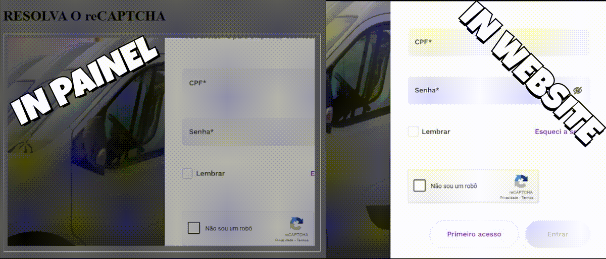

# 🛡️ Bypass reCAPCHA in SERVER to PANEL

<p align="center">
    </a>
</p>

🚀 **Descrição do Projeto**  
Este projeto demonstra uma abordagem para contornar o **reCAPTCHA**, permitindo que um servidor resolva o desafio e envie os resultados para um **painel de controle**.

🚀 **Onde Aplicar**  
Bots de WebScraping que executam demandas de trabalho via painel de gerenciamento, principalemente se você tem seu projeto em servidores, como exemplo AWS, Google Cloud, Proxmox e afins, não e todos que podem tem acesso já que o serviço pode cair facilmente se for mal gerenciado, desta forma trazer a imagem de dentro do navegador para a frente do painel de gerenciamento e um ponto importante de se realizar, e para isso e preciso ter um humano para que realiza a solução, assim o Bot pode seguir com seu trabalho.

---

## 🔥 Motivação

Temos um projeto que chamado **ROTOGRAMA**, o mesmo e responsavel por realizar um serviço que erá exercido por um colaborador, o mesmo levava **30 min** a **1h** para sair com resultado satisfatorio, entretanto esse tempo de espera e muito alto, dai surgiu a ideia, porque não realizar **WebScraping** e realoacar o colaborador em um **serviço mais produtivo** ?

**ROTOGRAMA** e um documento que é cobrado em **ISO**, além de que seu foco e para **empresas logisticas**, já que, o mesmo e para auxiliar o motorista no transporte da mercadoria, pois, contém em seu interior a rota, postos de combustiveis, postos fiscais, postos policiais e número desses lugares e do pessal da empresa, assim em qualquer ocasião de apoio o motorista consegue tomar uma descião mesmo que esteja em regiões sem acesso a dados moveis.

💡 Com este repositório, compartilho os seguintes itens:
- 🧑‍💼 **Client** (Painel Simplificado com 2 HTML (Mini Painel, Iframe), podendo ser importado em Pop-Pap).
- ⚙️ **Server** (Este item e um exemplo a ser seguido e implementado, a depender do projeto ).
- 📓 **.env** (Contendo tanto no **Client** quanto no **Server**, Facil de realizar o apontamento ).
---

## 📦 Tecnologias Utilizadas

- **[Flask](https://flask.palletsprojects.com/en/stable/)** - BackEnd da Aplicação
- **[OenCV](https://opencv.org/)** - Usado para o tratamento da imagem do server para client
- **[Selenium](https://www.selenium.dev/)** - Base usada para o controle do Navegador Google Chrome.
- **[JavaScript](https://developer.mozilla.org/pt-BR/docs/Web/JavaScript)** - Usado para puxar alguns elementos do DOM para Selenium.
---

## Estrutura do Projeto
```sh
Bypass-reCAPCHA-in-SERVER-to-PANEL/
├── Client/
│   ├── Config
│   ├── static
│   ├── templates
│   ├── .env
│   ├── client.py
├── Server/
│   ├── Config
│   ├── static
│   ├── .env
│   ├── Browser.py
│   ├── server.py
├── Video.mp4
└── README.md
```

## 🚀 Como Usar

### 1️⃣ **Clone o Repositório**
```sh

git clone https://github.com/JohnHeberty/Bypass-reCAPCHA-in-SERVER-to-PANEL.git
cd Bypass-reCAPCHA-in-SERVER-to-PANEL
```

### 2️⃣ **Instalação do requirement**
```sh
pip install -r requirements.txt
```
Agora sua senha foi alterada com sucesso! 🚀

### 3️⃣ **Suba o Client**
```sh
cd Client
python client.py
```
### 4️⃣ **Suba o Server**
```sh
cd Server
python server.py
```

---
### 🤝 Contribuições
---

Sinta-se à vontade para abrir issues, enviar comits e sugerir melhorias! 🚀

Toda ajuda é bem-vinda para aprimorar essa solução e fortalecer a segurança da comunidade.

---
### 📞 Contato
---
🧑‍💼 **Linkedin**: [John Heberty](https://www.linkedin.com/in/john-heberty/)

✉️ **E-mail**: john.7heberty@gmail.com

🔥 Não deixe a sua automatização Morrer! 🔥

